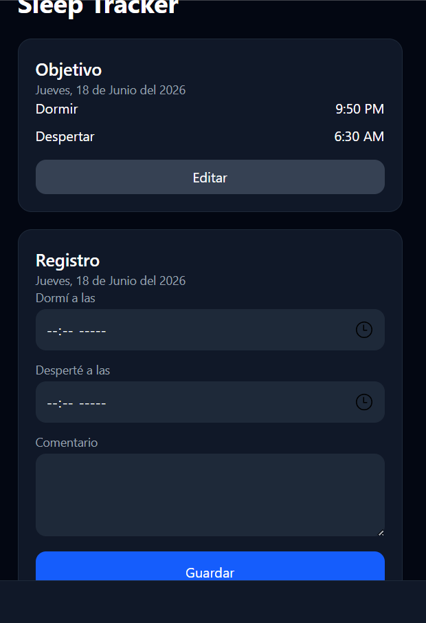
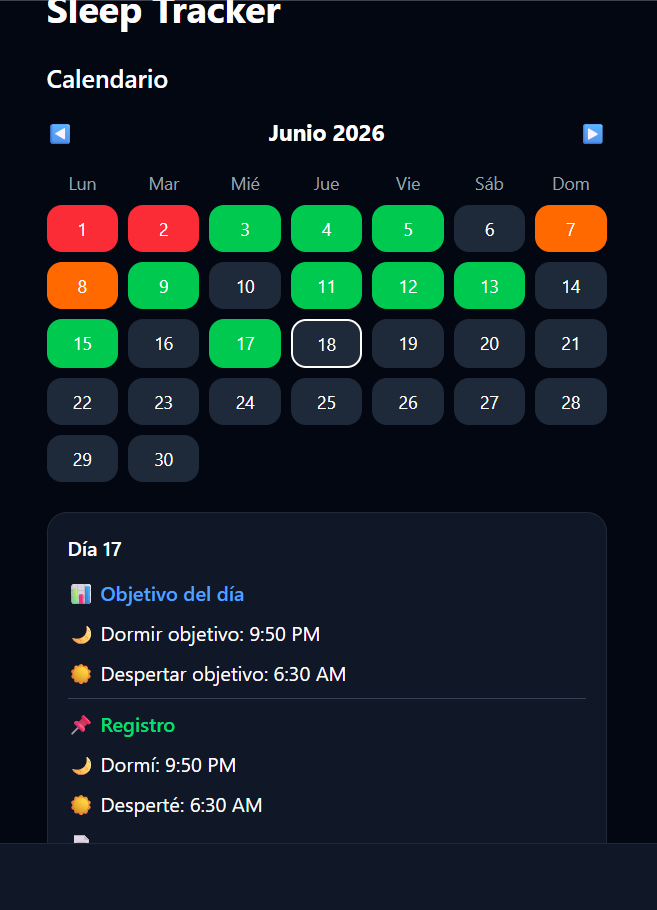

# 🌙 Sleep Tracker

Aplicación web desarrollada para registrar, monitorear y analizar hábitos de sueño de forma sencilla e intuitiva.

Este proyecto fue desarrollado como una aplicación personal con el objetivo de practicar tecnologías modernas del ecosistema JavaScript y el uso de Firebase como base de datos en la nube.

---

## 🚀 Características

✅ Registro diario de horas de sueño.

✅ Configuración de objetivos personalizados de descanso.

✅ Calendario interactivo para consultar registros.

✅ Historial de noches registradas.

✅ Almacenamiento de datos en Firebase Firestore.

✅ Interfaz responsive para dispositivos móviles y escritorio.

✅ Actualización en tiempo real de la información.

---

## 🛠️ Tecnologías Utilizadas

| Tecnología    | Descripción                           |
| ------------- | ------------------------------------- |
| ⚛️ React      | Desarrollo de la interfaz de usuario  |
| ⚡ Vite        | Entorno de desarrollo y compilación   |
| 🔥 Firebase   | Backend y almacenamiento de datos     |
| 🗄️ Firestore | Base de datos NoSQL en la nube        |
| 🎨 CSS3       | Estilos y diseño visual               |
| 🟨 JavaScript | Lógica de la aplicación               |
| 🌐 HTML5      | Estructura de la aplicación           |
| 🐙 Git        | Control de versiones                  |
| 🚀 GitHub     | Gestión y alojamiento del repositorio |

---

## 📸 Capturas de Pantalla

### 🏠 Registro y Objetivos de Sueño

En esta pantalla el usuario puede configurar su objetivo de descanso y registrar diariamente las horas de sueño.



---

### 📅 Calendario e Historial de Registros

Visualización del calendario junto con el historial completo de registros almacenados.



---

## 📂 Estructura del Proyecto

```text
sleep-tracker
│
├── public
├── screenshots
│   ├── home.png
│   └── calendario-registros.png
│
├── src
│   ├── App.jsx
│   ├── firebase.js
│   ├── index.css
│   └── main.jsx
│
├── package.json
├── vite.config.js
└── README.md
```

---

## ⚙️ Instalación

Clonar el repositorio:

```bash
git clone https://github.com/marulanda10/sleep-tracker.git
```

Ingresar al proyecto:

```bash
cd sleep-tracker
```

Instalar dependencias:

```bash
npm install
```

Ejecutar el proyecto:

```bash
npm run dev
```

---

## 🎯 Objetivo del Proyecto

Este proyecto fue desarrollado para fortalecer conocimientos en:

* React
* Manejo de estados
* Componentes reutilizables
* Firebase Firestore
* Consumo y almacenamiento de datos
* Desarrollo Frontend moderno
* Buenas prácticas de programación

---

## 👨‍💻 Autor

### Alexis Marulanda

Tecnólogo en Análisis y Desarrollo de Software (ADSO)

💼 LinkedIn:
https://www.linkedin.com/in/alexis-marulanda-41026b396/

🐙 GitHub:
https://github.com/marulanda10

📍 Cundinamarca, Colombia

---

⭐ Si este proyecto te resulta interesante, no olvides darle una estrella al repositorio.


